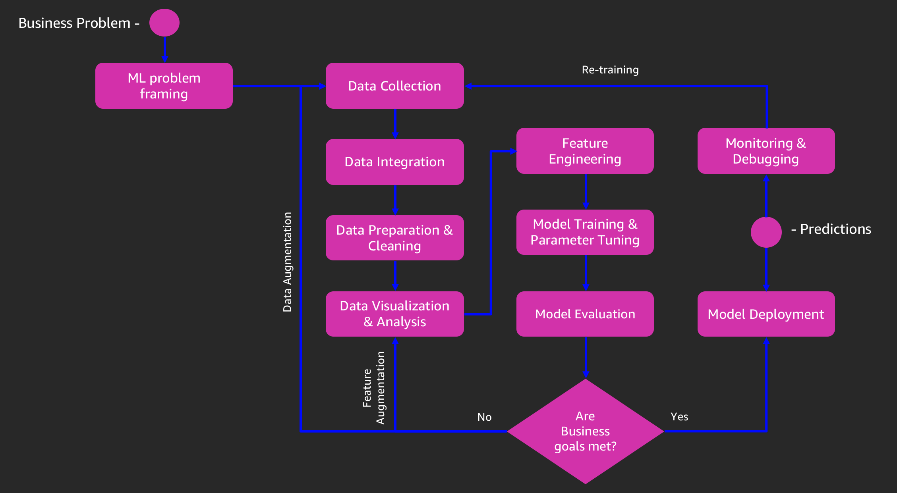
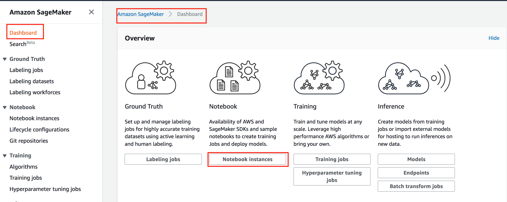
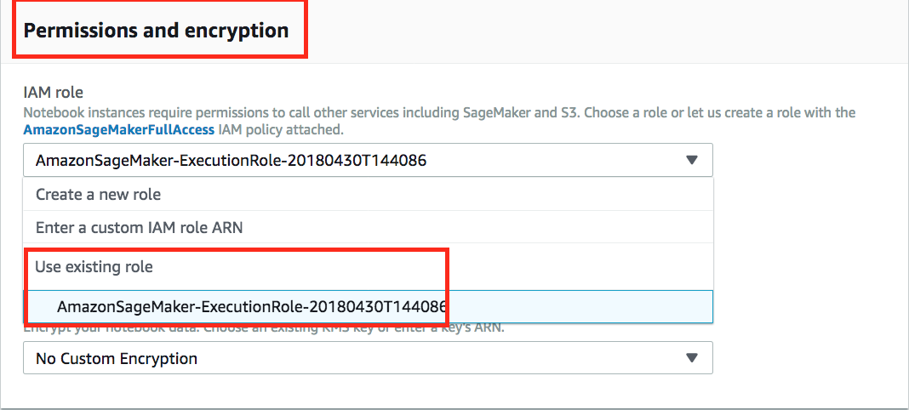
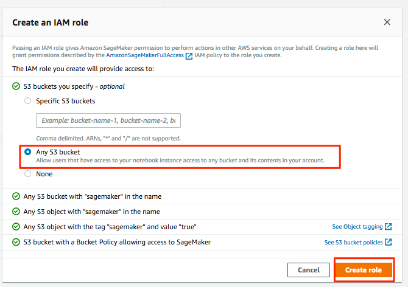
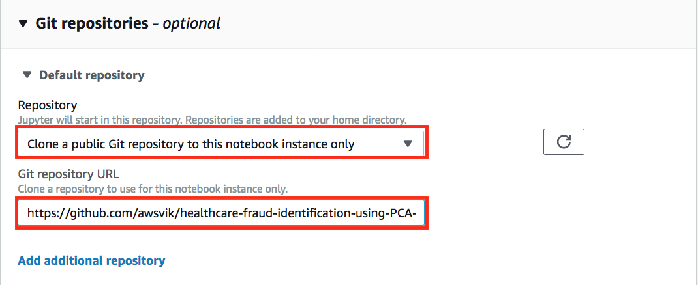
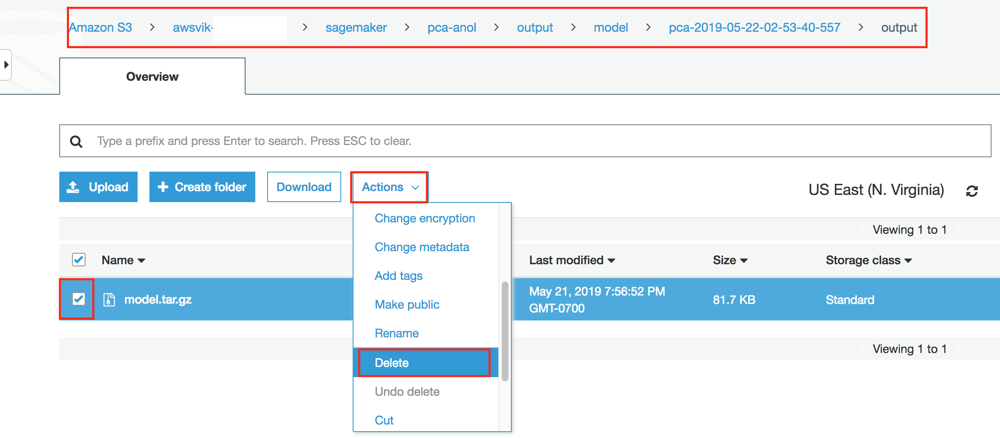
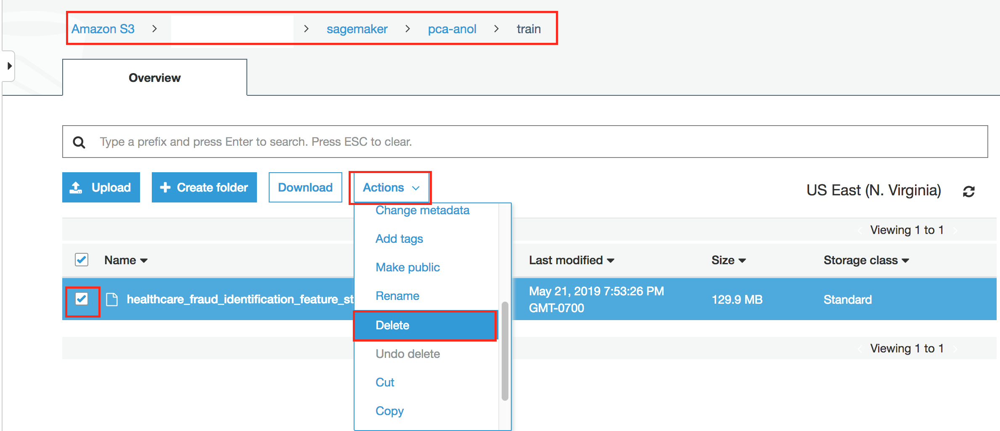

# Introduction

IDC study states that 40% of Enteprises in year 2019 will be working to include AI/ML as a part of their transformative strategy. AI/ML is beyond the hype cycle and there are usecases that are providing real business value. Customer looking to start their AI/ML journey understands AI/ML is hard and are looking to partner with Cloud Providers for support. They are making a choice not based on very specific capabilities or solution. Customers understands AI/ML projects are explorative and requires multiple iterations to get it right and requires broader capabilities from supporting partners. 10,000+ customers today choose AWS for AI/ML services because they understand that AWS provides deepest and broadest set of services for AI/ML. 

In today's workshop, we discuss the capabilities of Amazon SageMaker a machine leanring platform for Developers and Data Scientists. We will work a problem statement and will solve it by apply Machine Learning on Amazon SageMaker. Amazon SageMaker takes undifferentiated heavy lifting involved in Machine Learning process and will allow them to focus on solving business problem by training out of the box optimized algorithm on customer data and to deploy endpoint for inference to make business application intelligent.

Let's work a healthcare fraud identification useuse by applying a PCA algorithm and calculating anomaly score for each record using statistical techniques. You may find the concepts used in the workshop bit mathemaical. But, I would request you to develop the intution to understand the potential applications of techniques versus focussing too much on maths under the hood. The concepts discussed can be used in different industrial scanerios to solve broad category of problems and are not limited to specific usecase that we will discuss today.

## Learning Objectives
1. Understand Machine Learning Process
2. Develop intution for steps involved in Machine Learning Process
3. Understand how to do end to end machine lerning on Amazon SageMaker using Build, Train and Deploy pattern.
4. Understand how to clone a public gitrepo automatically in Amazon Sagemaker Notebook
3. Understand feature engineering on categorical data using Word Embeddings with CBOW-Bag of Words-technique
4. Understand PCA algorithm for feature extraction
5. Understand Unsupervised Anomaly detection on multivarite data
6. Understand visualization technique to develop understand anomalous results.

## Machine Learning process

## **Lab 0 - Launch an Amazon SageMaker Jupyter Notebook**

### Prerequisites and assumptions
1. To complete this lab, you need an AWS account that provides access to AWS services.
2. Credits will be provided to offset the cost of AWS usage charges incurred in this workshop.

### Steps
1. Sign In to the [AWS Console](https://aws.amazon.com/)
2. Click Services, search for **Amazon SageMaker** and Click **Amazon SageMaker** in the dropdown
3. After you land on Amazon SageMaker console, click on **Notebook Instances**
4. Click **Create Notebook**
5. Give Notebook a name you can remember and fill out configuration details as suggested in the screenshots below.
6. Select IAM Role
7. Create a new role if one doesn't exist. 
8. Privide  a path to clone public git repo that we will use today for our workshop to download data dictionary and Jupyter IPython Notebook
9. Provide the path of Git Repo.
6. Click **Create Notebook Instance**
8. In the Amazon SageMaker Console-->Notebook Instances, wait for your notebook instance to start. Observe change from Pending to In Service status.
9. Remember the name of your notebook instance and Click **Open Jupyter** for your notebook.
10. Validate your Resources cloned from Git Repo

## **Lab 1 - Finish your Lab in Jupter Notebook**
1. Click on **healthcare-fraud-identification-using-PCA-anomaly-detection.ipynb** and start working on your lab. From here onwards all the instruction will be in the Jupyter Notebook. Come back and after you have completed all the steps in the Jupyter Notebook and finish rest of the steps suggested below.

## Finish the Lab
1. **Congratulations!** you have finished all the labs. Please make sure to delete all resources as mentioned in the section below.

## Cleanup Resources
1. Go to Amason Sagemaker console to shutdown your notebook instance, select your instance from the list.Select **Stop** from the **Actions** drop down menu.

2. After your notebook instance is completely **Stopped**, select **Delete** fron the **Actions** drop down menu to **delete** your notebook instance.
4. Navigate to S3 Console. 

5. Find Bucket created in Lab 1 and Click to list objects in the bucket.
6. Navigate to the **model-tar.gz** and delete it by using **Actions** menu. 
6. Navigate to the training data file **healthcare_fraud_identification_feature_store** and delete it by using **Actions** menu.
7. After all the objects are deleted in the bucket. Go ahead and delete the bucket using the Actions menu.

## Complete the Survey
1. Complete the survey on your mobile app.

    

